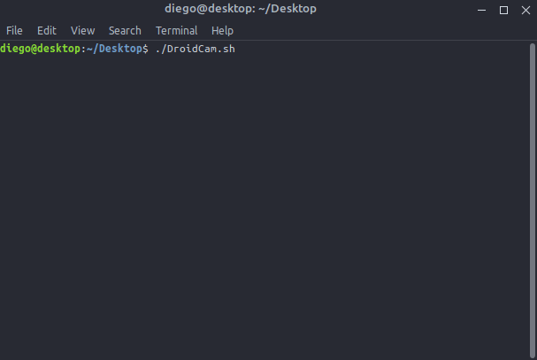

 

  

 

Olá eu criei esse shell script para facilitar minha vida, sempre que tem update do kernel do sistema o droidcam pede para que eu faça o update, ai eu sempre tinha que ir no site do dev usar o comando para remover depois outro comando para baixar e por fim o comando para instalar o droidcam.

Acabei criando um shell script que remove a versão antiga baixa a última versão e faz a instalação automática com um click.

  

  

  

### Referências

- [Droidcam](https://www.dev47apps.com/droidcam/linux/)
- [Operações básicas de gestão de pacotes.](https://www.debian.org/doc/manuals/debian-reference/ch02.pt.html#_basic_package_management_operations)
- [Ubuntu Manpage apt command-line interface.](https://manpages.ubuntu.com/manpages/focal/man8/apt.8.html)
- [Whiptail Wiki](https://en.wikibooks.org/wiki/Bash_Shell_Scripting/Whiptail)
- [Whiptail Ubuntu Manual](http://manpages.ubuntu.com/manpages/focal/man1/whiptail.1.html)
- [Ubuntu Beginners/BashScripting](https://help.ubuntu.com/community/Beginners/BashScripting)
- [Introdução à programação Shell](http://www.faqs.org/docs/air/tsshell.html)
- [Programando em shell script](http://www.devin.com.br/shell_script/)

 

---
>*OBS: Esse shellscript é apenas um projeto pessoal de fim de tarde use por sua conta e risco.*